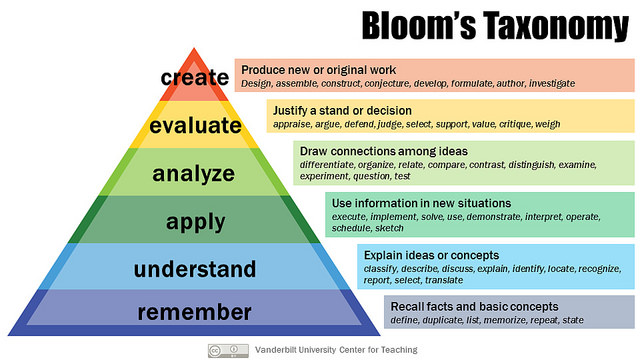

## Computing has quickly evolved to become the *third pillar* of science.

## High-level intended learning outcomes (ILO) during course design.

## Impart functional knowledge of various geophysical inversion algorithms.
## Active learning through interactive computing via post-lecture Jupyter Notebooks.

## Class projects have a focus on solving problems in the energy industry.
## Organize workshops during the semester to solve several computational assignments related to Earth sciences.

